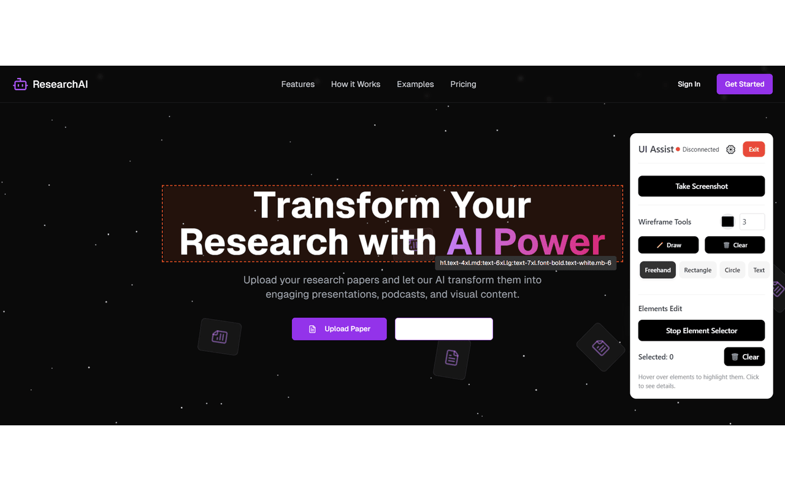
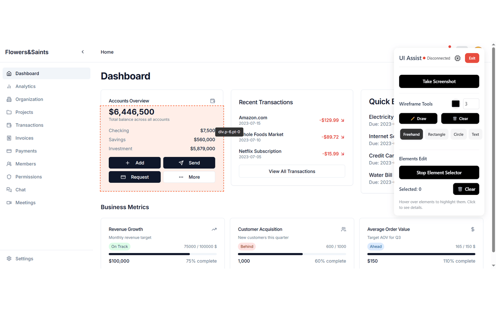
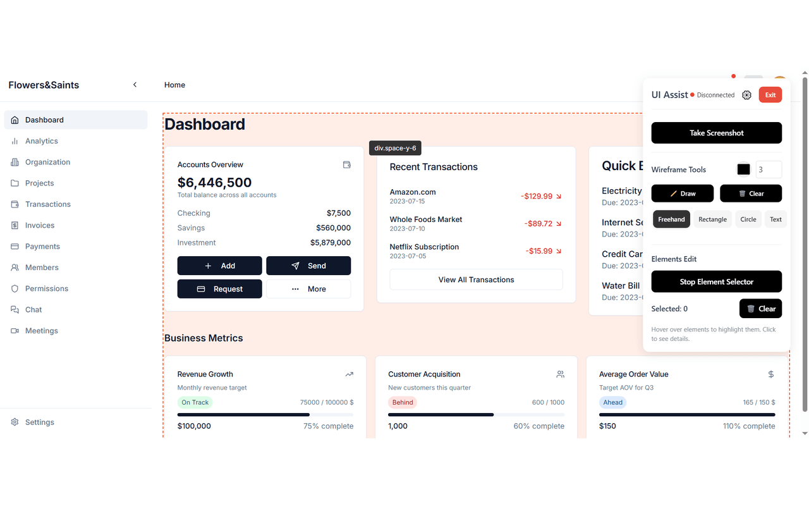
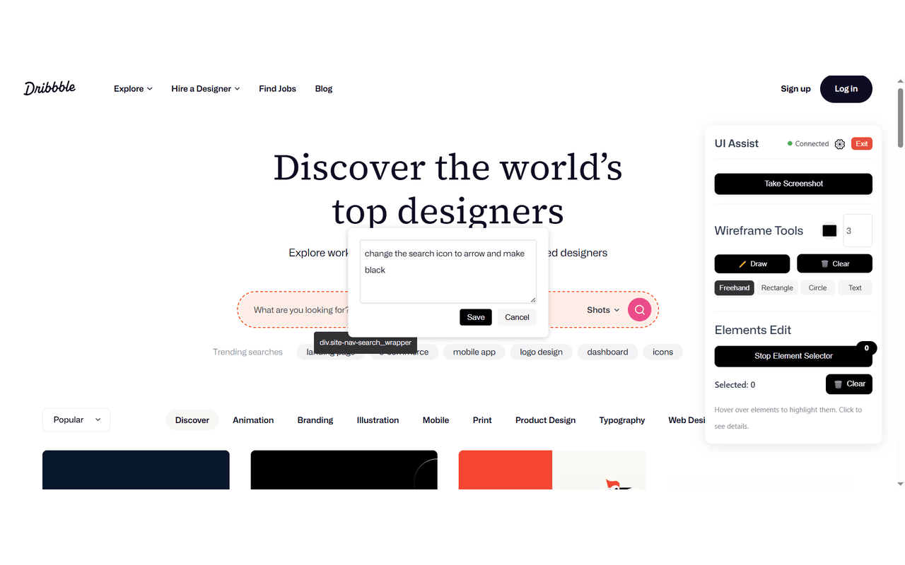

# UI Assist MCP Server

A Model Context Protocol (MCP) server that connects with the UI Assist Chrome extension to help with UI-based input in web development. This server implements the SSE (Server-Sent Events) transport type for MCP communication.

## Description

This MCP server provides tools to interact with a browser, allowing AI assistants to:

- Capture screenshots of current browser tabs
- Get and manipulate selected HTML elements
- Clear selections and perform other browser interactions
- Make targeted changes to specific UI elements through natural language instructions

## Interactive Element Selection and Manipulation

UI Assist enables precise control over web elements through an intuitive selection interface:



With UI Assist, you can:

1. Select specific elements on any webpage using the point-and-click interface
2. Give natural language instructions directly in the UI to modify only the selected elements
3. Make targeted changes to styling, content, or structure of selected components
4. Preview changes before they are applied
5. Apply modifications while maintaining the rest of the page intact

For example, you could:

- Select a specific card component and type "make this card's background lighter" directly in the UI
- Highlight multiple buttons and enter "change these buttons to a purple gradient theme" in the instruction field
- Select a navigation menu and input "add a drop shadow to this nav bar" in the UI




## Instructions Feature

UI Assist provides a powerful instructions interface that allows you to modify selected elements through natural language commands:



The instructions feature allows you to:

**Direct Element Targeting**: Instructions are applied specifically to the selected elements, ensuring precise modifications

Example instructions you can use:

- "Change this icon to a home icon"
- "Make this button larger and round"
- "Update the text color to dark blue"
- "Add a subtle hover effect"

## Wireframing and AI Generation

UI Assist includes powerful wireframing tools that enable rapid prototyping and AI-powered generation:

### Wireframe Tools

- **Draw Tool**: Freehand drawing for quick sketches and annotations
- **Rectangle Tool**: Create boxes and containers for layout planning
- **Circle Tool**: Add circular elements and icons
- **Text Tool**: Add text placeholders and labels

### Screenshot and Generation Workflow

1. Use the wireframing tools to sketch your desired layout
2. Add annotations and placeholder text to guide the AI
3. Take a screenshot of your wireframe using the "Take Screenshot" button
4. Ask Cursor AI to generate the actual implementation based on your wireframe

Example instructions you can give to Cursor after creating a wireframe:

- "Generate a React component matching this wireframe layout"
- "Create a responsive design based on this sketch"
- "Implement this card component with Tailwind CSS"
- "Generate a modern UI design following this structure"

The combination of visual wireframing and AI generation allows for:

- Rapid prototyping of UI concepts
- Clear communication of design intentions
- Immediate implementation of wireframe designs
- Iterative refinement through visual feedback

## Chrome Extension

To enable browser interaction capabilities, you need to install the UI Assist Chrome extension:

 [UI Assist Extension](https://chromewebstore.google.com/detail/cgpdancbdkpljflelfjpgdafebneible?utm_source=item-share-cb)

### Features

- 🔍 Element selection in browser tabs
- 📸 Screenshot capture support
- 🔄 Real-time synchronization with MCP server
- 🛡️ Secure local communication

### Installation Steps

1. Click the extension link above to open the Chrome Web Store
2. Click "Add to Chrome" to install the extension
3. Once installed, you'll see the UI Assist icon in your browser toolbar
4. Make sure the MCP server is running locally before using the extension you shoud be able to see connected

Once we reach 100 stars , we will open source the code extension code as well

## Installation

### Option 1: One-Click Installation via Glutamate App (Recommended)

The easiest way to install and set up UI Assist is through the Glutamate app:

1. Download and install [Glutamate](https://glutamate.app)
2. Open Glutamate and navigate to the Extensions section
3. Find UI Assist and click "Install"
4. The app will automatically configure everything for you and runs locally

### Option 2: Manual Setup

If you prefer to set up UI Assist manually, you have two options:

#### Global Installation

```bash
npm install -g @glutamateapp/ui-assist
```

Once installed globally, you can run the server directly:

```bash
ui-assist
```

#### Using npx

You can run the server without installation using npx:

```bash
npx @glutamateapp/ui-assist
```

## Configuration

The server can be configured using:

- `PORT`: Port for the MCP server (default: 7964)
- `CONNECTOR_PORT`: Port for the browser connector (default: 9025)

Examples:

```bash
# Using environment variables
PORT=3333 CONNECTOR_PORT=3026 ui-assist

# Using command line arguments
ui-assist --port=3333 --connector-port=3026
```

## Available Tools

### `get_selected_elements`

Retrieves HTML elements that have been selected in the browser, including any instructions provided directly in the UI.

**Example usage in Cursor AI:**

```
I've selected some elements in my browser and added instructions. Can you retrieve them and tell me about their structure and instructions?
```

### `clear_selected_elements`

Clears the list of selected elements.

**Example usage in Cursor AI:**

```
Please clear any selected elements from previous operations.
```

## Roadmap

### Upcoming Features

- **Element Movement**: Soon you'll be able to:
  - Drag and drop selected elements to new positions

## Complete Example Workflow

Here's a complete workflow example:

1. Start the MCP server
2. Open Cursor and ensure it's configured to use the MCP server
3. In a browser, navigate to a webpage
4. In Cursor, ask the AI: "Take a screenshot of my current browser page."
5. Select some HTML elements in the browser and enter instructions directly in the UI
6. In Cursor, ask the AI: "Retrieve the selected elements and explain their structure and follow instructions."
7. Once finished, ask the AI: "Clear the selected elements."

## Integration with AI Assistants

### Cursor Setup

To use this MCP server with Cursor:

1. Ensure the server is running:

   ```bash
   # If installed globally
   ui-assist

   # Or using npx
   npx @glutamateapp/ui-assist
   ```

2. Add the following configuration to Cursor's MCP section:

   ```json
   {
     "mcpServers": {
       "browser-tools": {
         "url": "http://localhost:3332/sse"
       }
     }
   }
   ```

3. Create or update your `mcp.json` file in your project root with the same configuration.
4. Adjust the port number if you've configured a different port.
5. Restart Cursor if necessary for the changes to take effect.

### Claude Desktop Setup

Add to your `claude_desktop_config.json`:

```json
{
  "mcpServers": {
    "uiassist": {
      "url": "http://localhost:3332/sse"
    }
  }
}
```

## Development

### Building from source

```bash
npm run build
```

### Watching for changes during development

```bash
npm run watch
```

## Repository

[https://github.com/ShadowCloneLabs/GlutamateMCPServers](https://github.com/ShadowCloneLabs/GlutamateMCPServers)

## License

MIT
